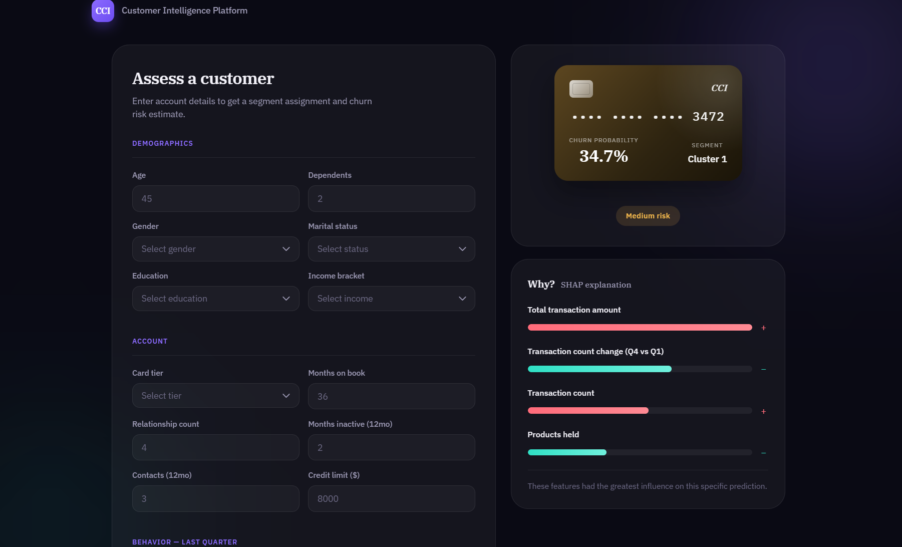

# Credit Card Customer Intelligence Platform

An end-to-end ML system that doesn't just predict credit card churn, 
It actually "segments customers" into behavioral groups, predicts who's likely to leave, explains *why* the model thinks so for every individual prediction, and connects the two together into an actionable retention story.A portfolio project to demonstrate the full pipeline a real data science team would ship: EDA + unsupervised learning + supervised learning + explainability, a live product, and a PowerBI dashboard, not just a notebook with an accuracy score at the end.

**Live demo:** https://credit-card-customer-intelligence.onrender.com/

**Full analysis notebook (Kaggle):** https://www.kaggle.com/dhruvloveskaggling

**Source code:** https://github.com/dhruuvvsharma/Credit-Card-Customer-Intelligence-Platform

Note: the live demo is hosted on Render's free tier, which sleeps after 15 minutes of inactivity. The first request after a period of inactivity can take 30–50 seconds to wake up 

---

## A quick look

**Live prediction UI** : with per-prediction SHAP explanation



**Power BI retention dashboard**

[Power BI Dashboard](Screenshots/PowerBI%20.png)

---

## Why this project is different???

Most churn prediction projects on Kaggle stop at "trained XGBoost, got 97% accuracy." That's the easy 80% of the work. This project asks a harder question: **so what?** A number in a notebook doesn't help a "retention team" decide who to call first, or explain to a manager why the model flagged a customer, or show whether the model is actually worth the engineering effort behind it.

So this project adds three things most churn notebooks skip entirely:

1. **Unsupervised segmentation before the classifier** : grouping customers by behavior first, then asking whether that grouping actually helps, rather than assuming it does.
2. **Per-prediction explainability in a live UI** : not just a SHAP plot buried in a notebook, but a "why?" panel on every prediction a user makes.
3. **A business-facing retention story** : connecting segments to actual churn rates and behavior, so the output is a decision support tool, not just a probability.

---

## The three-stage pipeline

```
Raw data (10,127 customers)
        │
        ▼
┌───────────────────┐
│  1. Segmentation   │  KMeans on 5 behavior features → Cluster_ID
│     (unsupervised) │
└─────────┬──────────┘
          │
          ▼
┌───────────────────┐
│  2. Classification │  Original features + Cluster_ID → Churn probability
│     (XGBoost)      │  (RandomForest also trained, XGBoost won on recall)
└─────────┬──────────┘
          │
          ▼
┌───────────────────┐
│  3. Retention      │  Cluster_ID + Churn_Probability + Actual_Churned
│     Analysis        │  → "which segment is at risk, and why"
└────────────────────┘
```

### Stage 1 : Why segmentation at all?

This was the question I had to answer honestly partway through the project, and the honest answer surprised me.

The instinct is: cluster customers first, then feed the cluster label into the classifier as a feature, and it'll improve accuracy. **I tested this directly, and it doesn't**, accuracy with `Cluster_ID` included was 97.58%, without it was 
97.43%. 
A SHAP importance ranking confirmed it: all four `Cluster_ID` dummy variables ranked in the bottom half of feature importance. The reason is simple once you see it: the cluster label is *derived from* five features the classifier already sees directly, so it isn't giving the model new information, just a compressed version of information it already has.

So why keep segmentation in the project at all? Because its value isn't classifier accuracy, it's 
**business interpretability**. A raw XGBoost classifier can tell you "this customer has an 85% churn probability." It can't tell you "this behavioral segment, representing 3,259 customers, churns at 2× the overall rate, and the reason is they've stopped using their card." That second sentence is what a retention team can actually act on, and it only exists because segmentation ran first. That distinction is the core argument of this whole project, and it's covered in detail in Stage 3 below.

**Feature selection wasn't guessed either.** From the EDA, five behavior features showed the largest mean differences between churned and retained customers: `Total_Revolving_Bal`, `Avg_Utilization_Ratio`, `Total_Trans_Ct`, `Total_Trans_Amt`, `Contacts_Count_12_mon`. I tested adding three more (`Months_Inactive_12_mon`, `Total_Ct_Chng_Q4_Q1`, `Total_Amt_Chng_Q4_Q1`) and the silhouette score got *worse* (0.2633 → 0.1651),so those features have weaker churn separation power and just added noise to the distance calculation. The number of clusters (k=4) came from a silhouette sweep across k=2 to k=7, not a guess.

**PCA is for visualization only.** I tested clustering directly on 2D PCA components instead of the original 5 scaled features, and the silhouette score jumped from 0.26 to 0.41 which looks like an improvement, but isn't. Silhouette score inflates naturally as dimensionality drops, and the 2D projection only retains 72% of the original variance, so the "better" clusters are an artifact of compression, not real structure. Cluster assignments between the two approaches only agreed 43% of the time. KMeans always clusters on the original 5 scaled features; PCA only produces the 2D scatter plot used to visualize the result.

### Stage 2: Why churn classification, and why XGBoost

The actual prediction task: given a customer's account and behavior data (plus their segment), predict whether they'll churn. Both RandomForest and XGBoost were trained, both weighted for the dataset's 84/16 class imbalance. XGBoost won, but not by raw accuracy **the model was selected by recall on the churn class**, because in a real retention context, missing an actual churner (a false negative) costs the business more than a false alarm (a false positive) does. Final numbers: 
97.58% accuracy, 93.85% recall, 99.23% ROC-AUC.

Explainability didn't stop at a global feature importance chart either. SHAP's `TreeExplainer` is loaded once at app startup (30ms) and computes per prediction SHAP values in 2ms fast enough to show a live "why?" breakdown for every single prediction a user makes in the deployed app, not just an aggregate chart in a notebook.

### Stage 3: Retention analysis: where segmentation actually pays off

Every customer gets scored with their `Cluster_ID`, predicted `Churn_Probability`, and actual `Attrition_Flag`, then grouped by segment. The result:

| Segment | Customers | Churn rate | vs. overall (16.07%) |
|---|---|---|---|
| Cluster 2 (highest risk) | 3,259 | **32.34%** | +16.28% (2× risk) |
| Cluster 1 | 2,382 | 18.81% | +2.74% |
| Cluster 0 | 1,170 | 2.99% | −13.07% |
| Cluster 3 (lowest risk) | 3,316 | **2.71%** | −13.35% |

Comparing the highest- and lowest-risk segments' average behavior explains *why*: the highest risk segment has a near-zero `Avg_Utilization_Ratio` (0.03) and a much lower `Total_Revolving_Bal` (₹248) than the most loyal segment (0.48 utilization, ₹1,612 balance). **Customers who stop using their card are the early churn signal** — a retention team could act on a dropping utilization ratio before the customer actually leaves, rather than reacting after the fact. This is the concrete output that only exists because Stage 1 ran before Stage 2, and it's the answer to "why segmentation."

---

## What's actually deployed

The pipeline isn't just notebook code, it's a working product:

- **A live FastAPI app** with a two column UI: a form for customer details on the left, a real-time result panel on the right showing the predicted segment, a churn-probability "card" (styled like an actual credit card, complete with a masked number and chip icon), and a **"Why? SHAP explanation"** panel with the top 4 features driving that specific prediction, color-coded by whether they push risk up or down.
- **A JSON API endpoint** (`/api/predict`) for programmatic access, separate from the HTML form flow.
- **A Power BI dashboard** built from `retention_dataset.csv`, with DAX measures computing cluster-level churn rates live rather than relying on a pre-aggregated file.
- **A Kaggle notebook** covering the full pipeline (EDA → segmentation → classification → SHAP → retention analysis), published as a single "living" notebook that's updated in place as the project grew, rather than scattered across multiple disconnected notebooks.

---

## Problems I actually ran into (and how they got fixed)

A portfolio project's value isn't that everything worked first try, it's what got debugged along the way. A few honest ones:

- **`segmentation.py` imported PCA but never used it.** `pca.pkl` was in the planned artifact list but was never actually being generated, since nothing called `.fit()` on the PCA object. Added a dedicated `fit_pca_for_visualization()` step, kept deliberately separate from the actual KMeans clustering.
- **Newer Starlette broke the FastAPI templates.** `TemplateResponse(name, {"request": request, ...})` — the older argument order — silently produced a `TypeError: unhashable type: 'dict'` under a newer Starlette version, which expects `TemplateResponse(request, name, context)` instead. A one-line reorder fixed it, but it took reading the actual installed signature to catch.
- **Dropdowns were invisible.** White text on a white background — browsers ignore a parent `<select>`'s styling for the native `<option>` list, so `select option { color: ...; background-color: ...; }` had to be set explicitly.
- **`retention_dataset.csv` got committed to Git before being moved to DVC.** Fixed with `git rm --cached`, added to `.gitignore`, then properly `dvc add`-ed.

---

## Tech stack

| Layer | Tools |
|---|---|
| EDA | Pandas, NumPy, Matplotlib, Seaborn, Jupyter |
| Segmentation | scikit-learn (StandardScaler, KMeans, silhouette_score), PCA |
| Classification | scikit-learn (RandomForest), XGBoost |
| Explainability | SHAP |
| Deployment | FastAPI, Jinja2, Docker, Render |
| Dashboard | Power BI |
| Data/model versioning | Git + DVC |

---

## Project structure

```
Credit-Card-Customer-Intelligence-Platform/
├── artifacts/                    # Trained models, preprocessors, generated datasets
├── data/raw/                     # Source CSV (DVC-tracked)
├── notebook/                     # EDA.ipynb
├── PowerBI/                      # .pbix dashboard
├── src/my_project/
│   ├── components/                # data_ingestion, segmentation, data_transformation,
│   │                              # model_trainer, retention_analysis, explainability
│   └── pipelines/                 # training_pipeline.py, prediction_pipeline.py
├── fastapi_app/
│   ├── main.py
│   ├── templates/index.html
│   └── static/style.css, script.js
├── Dockerfile
├── docker-compose.yml
└── requirements.txt
```

---

## Running it locally

```bash
git clone https://github.com/dhruuvvsharma/Credit-Card-Customer-Intelligence-Platform.git
cd Credit-Card-Customer-Intelligence-Platform
python -m venv venv
venv\Scripts\activate        # Windows
pip install -r requirements.txt

# Run the full training pipeline (ingestion → segmentation → classification → retention analysis)
python -m src.my_project.pipelines.training_pipeline

# Start the app
python -m uvicorn fastapi_app.main:app --reload
```

Or with Docker:

```bash
docker compose up --build
```

---

## Results summary

- **Segmentation:** 4 customer segments, silhouette score 0.2633 (k chosen via sweep, not guessed)
- **Classification:** XGBoost, 97.58% accuracy, 93.85% recall, 99.23% ROC-AUC
- **Retention insight:** highest risk segment churns at 2× the overall rate; the signature is near-zero card utilization
- **Deployed:** live FastAPI app with per prediction SHAP explanations, plus a Power BI dashboard and a full Kaggle writeup